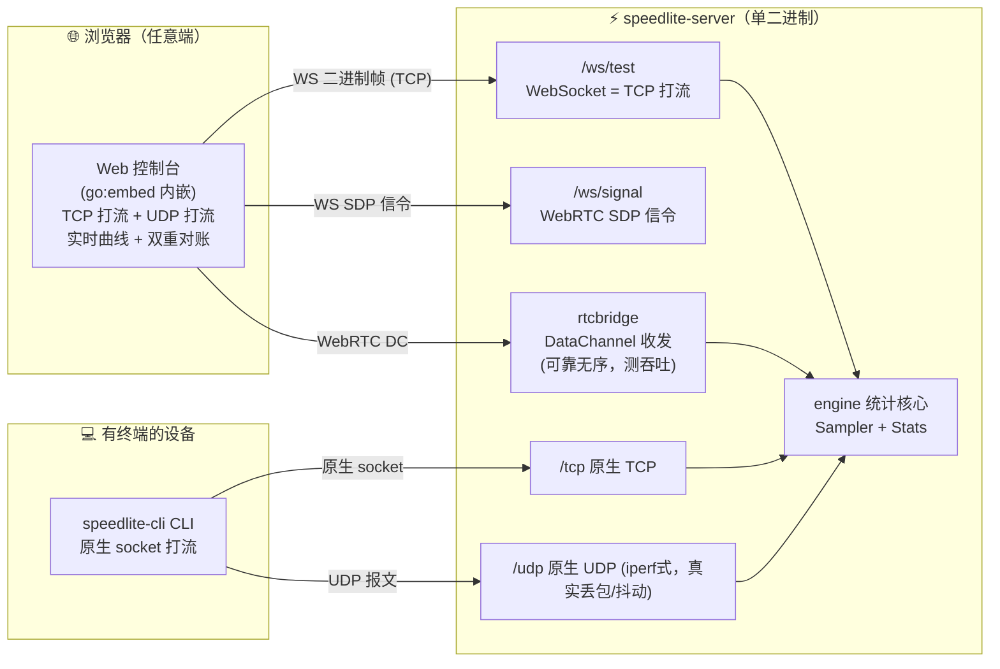
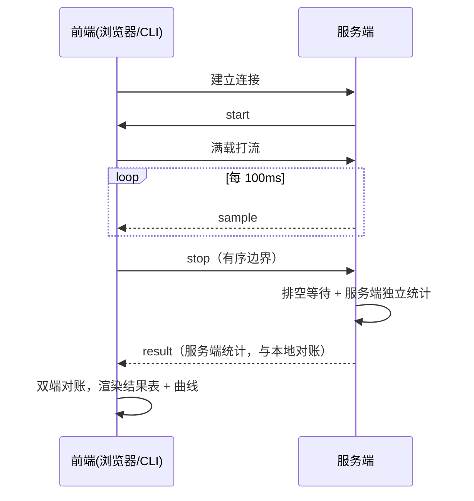

# ⚡ SpeedLite · 带宽测速（Go）

> **一句话**：上传即可用的带宽测速工具。浏览器开网页就能测 TCP/UDP 上下行带宽；`speedlite-cli` 命令行测极限值；**每一个结果都带服务端独立统计做双重对账**，可信度一目了然。

**单二进制交付**：一个文件就是完整服务端（内嵌 Web 前端），`go:embed` 打包，拷贝即用。支持跨平台/跨架构分发，**浏览器测 + CLI 测**双端覆盖。

---

## ✨ 核心功能

| 功能 | 说明 |
|---|---|
| 🌐 **浏览器即测** | 打开网页一点就测，无需安装任何客户端（桌面/安卓都能用） |
| 💻 **命令行精确测** | `speedlite-cli` 原生 socket，贴近线速，iperf 风格 |
| 🔀 **TCP / UDP 双模式** | 可单选 TCP、UDP，或 TCP+UDP 连测 |
| ⬆⬇ **四种链路** | TCP 上行 / TCP 下行 / UDP 上行 / UDP 下行，可单独、组合、双向 |
| 📦 **包长可调** | 预设多档（高频小包 / RTP 包 / 类720p / 类1080p / 媒体混合）+ ⚙ 自定义包长 |
| 📈 **带宽探测曲线** | 自动「爬升 → 发现瓶颈 → 稳定」，1s 滑动窗口平滑，杜绝锯齿假象 |
| ✅ **双重对账** | 浏览器本地统计 + 服务端独立统计，结果表直接展示两端差值 |
| 🖥 **优雅界面** | 深色仪表盘、实时曲线、历史曲线缓存、图例对比多次测试 |
| 📊 **按包长分类记录** | 结果 / 历史 / 曲线都记下包长，不同包长相的结果互不覆盖 |
| 📱 **单文件部署** | 一个二进制内嵌全部前端，`CGO_ENABLED=0` 静态编译，老系统也能跑 |
| 📦 **多架构/多系统分发** | 一键构建 Linux/Windows/macOS/ARM/MIPS 等平台发行包 |

---

## 🚀 快速开始

### 1. 直接运行（最快上手）

构建或拿到产物后，**一条命令起服务**：

```bash
./speedlite-server -http :8080 -tcp :5001 -udp :5201
```

- Web 页面（浏览器测）：打开 `http://服务器IP:8080`
- CLI（命令行测）：`./speedlite-cli -s 服务器IP tcp down -P 4 -t 10`

端口可任意改：

| 参数 | 默认 | 用途 |
|---|---|---|
| `-http` | `:8080` | Web 页面 + WebSocket(TCP) + WebRTC 信令(UDP) |
| `-tcp` | `:5001` | 原生 TCP 测速端口（CLI 用） |
| `-udp` | `:5201` | 原生 UDP 测速端口（CLI 用） |

### 2. 一键构建多平台（makeVersion）

```bash
./makeVersion.sh          # 读 config/version.ini，构建全部平台到 dest/<平台名>/
./makeVersion.sh 1.2.3    # 临时指定版本
./makeVersion.sh -h       # 帮助
```

产物**按平台目录 + 发行包 + 校验和**归类，直接分发：

```
dest/linux_x64/
├── speedlite-server          # 服务端（静态、无 glibc 依赖）
├── speedlite-cli                  # 命令行客户端
├── SHA256SUMS                # 校验和
└── speedlite-1.1.0-linux_x64.tar.gz
```

---

## 🌍 多架构 / 多系统分发

`config/version.ini` 的 `[platforms]` 声明目标平台矩阵，`makeVersion.sh` 一键产出：

```ini
[version]
major = 1
minor = 1
patch = 0

[platforms]
linux_x64    = linux/amd64
linux_arm64  = linux/arm64
linux_arm    = linux/arm
linux_x86    = linux/386
linux_mips   = linux/mips
windows_x64  = windows/amd64 .exe
darwin_x64   = darwin/amd64
darwin_arm64 = darwin/arm64
```

> 想要更多平台？在 `[platforms]` 加一行即可（如 `linux_riscv64 = linux/riscv64`）。

**适合谁**：
- 给 Linux/Windows/macOS/ARM 服务器或设备分发测速服务
- 老系统（CentOS 7 / Ubuntu 18 等）用静态二进制，免依赖
- 多平台巡检 / 批量测速

---

## 🌐 Web 页面测速（浏览器即用）

浏览器打开 `http://服务器IP:8080`，配置好参数点「▶ 开始测速」即可。

### 配置面板

| 配置项 | 说明 |
|---|---|
| **模式** | TCP（WebSocket） / UDP（WebRTC） / TCP+UDP 连测 |
| **方向** | 下行 / 上行 / 双向 |
| **并行流数** | 1–16，默认 4（多流可榨干多核/多队列） |
| **时长（秒）** | 1–120，默认 10 |
| **包大小（档位）** | 下拉选 + ⚙自定义：固定·高频小包(512B) / 固定·RTP包(1200B) / 固定·类720p(1400B) / 固定·类1080p(1500B) / 动态·媒体混合(512/1200/1400/1500 轮换) / 自定义·固定 / 自定义·动态 |
| **服务器地址** | 留空 = 当前页面所在服务器；可填局域网另一台 |

### 结果怎么看

每一行是一条链路，明细行给出**服务端独立统计（对账）**：

```
TCP 下行 ▼ 948.7 Mbit/s │ 峰值 1072.2 │ 传输 1.11 GiB │ 丢包 0%
4 条并行流 · 下行 1.11 GiB · 服务器对账: 传输 1.11 GiB · 平均 909 Mbit/s · 峰值 1450 Mbit/s · 对账正常
```

- **对账正常**：双端字节一致（<1% 偏差），可信。
- **对账异常 ⚠**：双端不一致，提示异常断链/边界问题。
- **交付损失 / 队列截断**：UDP 场景的明细提示。

### 交互按钮

`▶ 开始测速` / `■ 停止` / `⟳ 刷新清空`（清曲线与结论，历史保留）/ `清空历史`。

### 曲线与历史

- **实时曲线**：canvas 绘制上下行速率，自动「爬升→稳定」，1s 滑动窗口平滑。
- **历史曲线缓存**：多次测试曲线叠加对比，图例区分链路 + 包长 + 时间。
- **按包长分类**：固定包长 / 动态包长各自记录，互不覆盖。

---

## 💻 CLI 精确测速（speedlite-cli）

原生 socket，贴近线速，适合**要极限值 / 要 UDP 丢包与抖动**的场景（iperf 风格）。

```bash
# TCP 下行 / 上行（各 4 流，10 秒）
./speedlite-cli -s 服务器IP tcp down -P 4 -t 10
./speedlite-cli -s 服务器IP tcp up   -P 4 -t 10

# UDP 下行 / 上行（单流大包，丢包率低）
./speedlite-cli -s 服务器IP udp down -P 1 -l 60000 -t 10
./speedlite-cli -s 服务器IP udp up   -P 1 -l 60000 -t 10

# 自定义端口 + 更多流
./speedlite-cli -s 服务器IP -tcp-port 5001 -udp-port 5201 tcp down -P 8 -t 5
```

flags 可放在任意位置（含位置参数之后）。UDP 输出**丢包率、抖动（RFC3550 Jitter）**。

---

## 📊 结果示例

Web 页面 / CLI 都能得到类似结果：

```
⚠ speedlite-cli → 192.168.0.202
模式=tcp 方向=down 流数=4 时长=5.0s 包大小=131072B
总传输:   54.13 MiB
平均速率: 10.54 MB/s (84.28 Mbit/s)
峰值速率: 12.0 MB/s (96.0 Mbit/s)      # 峰值略高于平均，正常
实际用时: 5.14 s
```

---

## 🔧 技术原理（深入了解用）

### 测速算法

**核心目标**：以最快速度打流，但不瞬间打满链路，让曲线呈「爬升 → 发现瓶颈 → 稳定」，同时双端独立统计做对账。

| 环节 | 策略 |
|---|---|
| 采样 | 每 100ms 一个窗口 |
| 实时速率 | 1s 滑动窗口均值（消除锯齿） |
| 峰值 | 1s 滑动窗口平均（抗虚高，杜绝"内存拷贝速度"假象） |
| 上行校正 | 累计发送 − 缓冲滞留（只统计真实排空到网络的字节） |
| 下行背压 | WebRTC 用 `bufferedAmount` 高/低水位 |
| 结束边界 | TCP 有序 `start/stop/result` 对齐双端统计 |

**两条无锯齿关键设计**：
1. **TCP 下行**尽力快速打流 + TCP 自身拥塞控制爬升/回退。
2. **前端 1s 滑动平均**显示，即使底层突发/背压，曲线也平滑呈「爬升→稳定」。

### 双重对账

每个流结束时，服务端**独立回传一份统计**（`result`）：

| 链路 | 浏览器侧 | 服务端侧（对账方） |
|---|---|---|
| TCP 下行 | 收到字节数 | WS 发送字节数 |
| TCP 上行 | 有序 stop 前发送字节数 | 收到 stop 前 WS 数据字节数 |
| UDP 下行 | DataChannel 收到字节数 | DC 提交 − 队列残留 |
| UDP 上行 | DC 提交 − 队列残留 | DC 接收字节数 |

TCP 正常偏差 <1%；UDP 分别显示提交/排空/接收/残留，残留>0 标「队列截断」。

---

## 🏗 架构

Go 单二进制服务端：`go:embed` 内嵌 Web 前端，同时接管 WebSocket(TCP)、WebRTC 信令(UDP)、原生 TCP/UDP 端口。浏览器与 CLI 共享同一 `engine` 统计核心。



### 两条测速通路

- **Web 侧（浏览器）**：TCP 走 WebSocket（≈原生 TCP）；UDP 走 WebRTC DataChannel（可靠无序，稳定测吞吐）。
- **CLI 侧（speedlite-cli）**：原生 TCP/UDP socket，贴近线速，能测真实 IP 层 UDP 丢包/抖动。

### 单流测速时序



---

## 📁 目录结构

```
speedlite/
├── makeVersion.sh               # 版本化多平台构建脚本
├── config/
│   └── version.ini              # 版本号 + 产物名 + 目标平台矩阵
├── src/                         # Go 源码（module 根）
│   ├── cmd/
│   │   ├── speedlite-server/    # 服务端入口 + web/(go:embed 前端)
│   │   │   └── web/             # index.html / app.js / style.css
│   │   └── speedlite-cli/            # CLI 客户端
│   └── internal/
│       ├── engine/              # 采样/统计核心（纯逻辑，有单元测试）
│       ├── version/             # 构建期注入版本号
│       ├── wsstream/            # WebSocket TCP 打流
│       ├── tcpnative/           # 原生 TCP 测速（CLI）
│       ├── udpnative/           # 原生 UDP 测速（CLI）+ iperf式统计
│       └── rtcbridge/           # WebRTC 信令 + DataChannel 打流
├── dest/                        # 构建产物（gitignored）
├── docs/
│   ├── 用户手册.md              # 网页与 CLI 使用教程
│   └── 部署指南.md              # 部署/常驻/防火墙/静态编译
└── go.mod                       # （位于 src/ 内）
```

---

## 🧪 测试

```bash
cd src
go test ./...          # 单元测试（engine、udpnative）
```

前端计数与渲染自测（Node 内置测试，无 npm 依赖）：

```bash
cd src && node --test cmd/speedlite-server/web/app.test.mjs
```

---

## ⚠️ 限制与精度说明

- 网页侧 WS/WebRTC 受浏览器协议栈开销影响，数值为"浏览器可达吞吐"；极限/精确数值请用 `speedlite-cli`（原生 socket）。
- 网页 UDP 用 WebRTC **可靠无序**通道测吞吐（稳定不死锁）；交付损失为 0。**真实 IP 层 UDP 丢包/抖动**请用 `speedlite-cli udp`。
- 测速结果为**尽力而为**的带宽指示：TCP 拥塞控制、UDP 重传策略、对端 NAT 都会影响读数；同一链路多次测试取峰值/均值更接近真实上限。

---

## 📄 更多文档

- **[docs/用户手册.md](docs/用户手册.md)**：网页与 CLI 完整使用教程
- **[docs/部署指南.md](docs/部署指南.md)**：部署 / 常驻 / 防火墙 / 静态编译 / 老系统 / systemd
